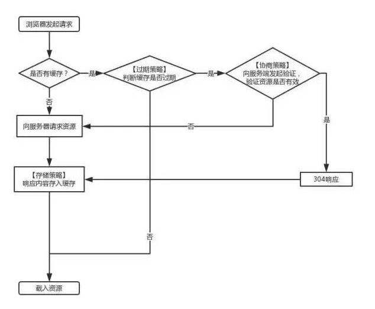

# 在浏览器地址栏输入 URL 以后

## DNS

...

## 服务端

网关、nginx、负载均衡、内网映射、静态资源服务器/应用服务器、响应 500/404...

## 缓存控制

当浏览器再次访问一个已经访问过的资源时，它会这样做：

1. 看看是否命中强缓存，如果命中，就直接使用缓存了。
2. 如果没有命中强缓存，就发请求到服务器检查是否命中协商缓存。
3. 如果命中协商缓存，服务器会返回 304 告诉浏览器使用本地缓存。
4. 否则，返回最新的资源。

### 强制缓存

#### Expires

一个绝对时间的 GMT 格式的时间字符串

#### Cache-Control

- **no-cache：** 需要进行协商缓存，发送请求到服务器确认是否使用缓存。
- **no-store：** 禁止使用缓存，每一次都要重新请求数据。
- **public：** 可以被所有的用户缓存，包括终端用户和 CDN 等中间代理服务器。
- **private：** 只能被终端用户的浏览器缓存，不允许 CDN 等中继缓存服务器对其缓存。

Cache-Control 与 Expires 可以在服务端配置同时启用，同时启用的时候 Cache-Control 优先级高。

### 协商缓存

#### Last-Modify(response)/If-Modify-Since(request)

一个标识该资源的最后修改时间

#### ETag(response)/If-None-Match(request)

一个标识资源唯一的校验码

Last-Modified 与 ETag 是可以一起使用的，服务器会优先验证 ETag，一致的情况下，才会继续比对 Last-Modified，最后才决定是否返回 304。

## 浏览器渲染

